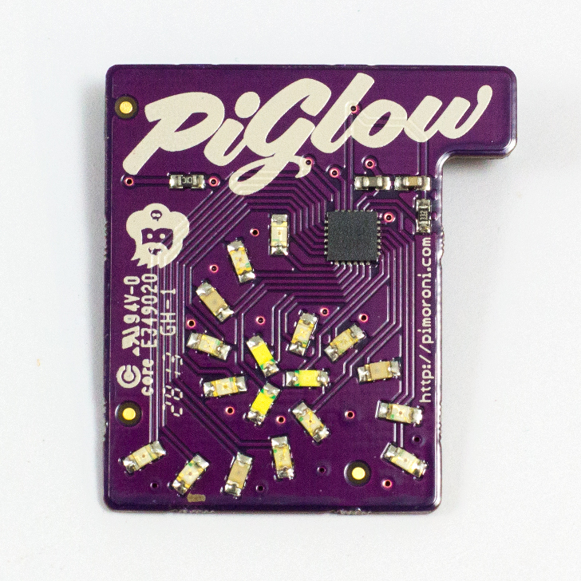

# Make your Raspberry Pi Glow

##Introduction

You may have a funky LED board for your Raspberry Pi called a [PiGlow](http://shop.pimoroni.com/products/piglow). 



This project gives you the opportunity to put your PiGlow to good work by programming it using Python. First you will need to set up your Raspberry Pi by configuring some files and downloading some modules. Then you can start to make individual LEDs blink, before getting them to pulse in pretty ways for displays!

##Requirements

- Raspberry Pi
- Micro USB power adaptor
- An SD card with Raspbian already set up through NOOBS
- USB keyboard
- USB mouse
- HDMI cable
- A monitor or TV
- A PiGlow
- An internet connection (Ethernet or WiFi) to download the required files


## Step 0: Setting up your Pi

First check that you have all the parts you need to get your Raspberry Pi set up and working.

- Raspberry Pi
- Micro USB power adaptor
- An SD card with Raspbian already set up through NOOBS
- USB keyboard
- USB mouse
- HDMI cable
- A monitor or TV

###Activity checklist:

1.	Place the SD card into the slot of your Raspberry Pi. It will only fit one way so be careful not to break the card. 
2.	Next connect the HDMI cable from the monitor (or TV) to the HDMI port on the Pi and turn on your monitor. 
3.	Plug the USB keyboard and mouse into the USB ports on the Pi.
4.	Plug in the micro USB power supply and you should see some text appear on your screen.
5.  When prompted to login type:

    ```
    Login: pi
    Password: raspberry
    ```
    
## Step 1: Setting up your Raspberry Pi to use PiGlow

In order to use your PiGlow board, there are some settings that need to be changed and some files that need to be downloaded. 

*Note: PiGlow is based on an IC that communicates via the i2c protocol. We need to enable i2c communication on your Raspberry Pi to allow it to work.*

###Activity checklist:

1. Enable the i2c driver modules by editing the modules config file:

    ```
    sudo nano /etc/modules
    ```

2. Then either **add** or ensure the following lines are at the end of the file:

    ```
    i2c-dev
    i2c-bcm2708
	```
	Press **CTRL** and **X**, followed by **Y** and **Enter** to save your changes.
	
3. You may also need to ensure the driver modules are not blacklisted by editing the blacklist config file. Type the following:
	
	```
    sudo nano /etc/modprobe.d/raspi-blacklist.conf
	```

4. Comment out the following lines by adding a # sign at the start of the line. So:

    ```
    blacklist spi-bcm2708
    blacklist i2c-bcm2708
	```
	
	...should become...

	```
   	# blacklist spi-bcm2708
    # blacklist i2c-bcm2708
    ```
    
    Then save and exit by pressing **CTRL** and **X**, followed by **Y** and **Enter**.

5. Now download and install the i2c libraries and Python support by typing the following:

    ```
    sudo apt-get install python-smbus
	```
	
6. Finally, reboot your Pi!


## Step 2: Test your PiGlow using the PyGlow module

To program the PyGlow with your Raspberry Pi you will need to download and use the PyGlow Python module. Your Raspberry Pi will need to be connected to the internet in order to this.

###Activity checklist:

1. Begin by creating a folder or directory for your PyGlow files by typing `mkdir pyglow`.

2. Next, change to the pyglow folder by typing `cd pyglow`.

3. This folder will be empty; you can see this by typing `ls` to check the folder's contents.

4. Download the Python file required by typing the following all one one line and pressing **Enter** on your keyboard:

	```
        wget https://raw.github.com/benleb/PyGlow/master/pyglow.py --no-check-certificate
	```
5. 	This will give you a file called pyglow.py. This file is the module and will do all the hard work for you.

6. Now download `test.py`, which is a program to test that your PiGlow will work, by typing the following:

	```
        wget https://raw.github.com/benleb/PyGlow/master/examples/test.py --no-check-certificate
	```
	
7. Once downloaded, run it by typing: 

    ```
    sudo python test.py
	```
8. The program will ask you to set a number between 0 (off) and 255 (brightest) for each colour. Type the following values:

	```
	White: 10
	Blue: 20
	Green: 30	
	Yellow: 40
	Orange: 50
	Red: 60
	All: 1
	```
	Press **Enter** and you should see the PiGlow light up!
	
## Step 3: Creating a PiGlow program

Now that you have all the files that you need for your PiGlow, it is time to create your very first glowing LED program using Python. In this step you will learn how to import the functions that you need from the modules to turn individual LEDs on the PiGlow on and off.


###Activity checklist:

1. To write your glowing PiGlow program using Python, you will need to open **IDLE** by double-clicking on the desktop icon.

2. Once the Python shell has loaded click on **File** and **New Window** to open a new text editor file.

3. Save this file as `FirstPiGlow.py` by clicking on **File** and **Save As**.

4. Begin your program by importing the Pyglow module and the Time module: 

	```python
    from pyglow import PyGlow
    from time import sleep
    ```
5. Now initialise the module by typing the following underneath:

	```python
    pyglow = PyGlow()
	```
6. Next, set all the LEDs on the PiGlow to `0` or **off**:

	```python
	pyglow.all(0)
	```
7. We are now going to turn on LED 1 on the PiGlow for one second and then off again by typing:

	```python
	pyglow.led(1,100)
	sleep(1)	
	pyglow.led(1,0)
	sleep(1)
	```
8. To light up the LEDs add the following:

	```python
	pyglow.update_leds()
	```
9. Save your file by clicking on **File** and **Save**.

10. In an LXTerminal window type the following to run your program:
	
	```
	sudo python FirstPiGlow.py
	```		
	
	Make sure you keep an eye on your PiGlow to see if LED 1 lights up! 
	
###Challenge:

Now that you have LED1 turning on and off, why not see if you can turn any of the other LEDs on and off in a similar way?	
	
## Step 4: Add a loop to make the lights flash

In the last step, you created a program to turn LED1 on and off on the PiGlow. We can now add a loop to repeatedly turn groups of coloured LEDs on and off.

###Activity checklist:

1. Open the file `FirstPiGlow.py` in **IDLE**.

2. Underneath `pyglow.all(0)` type the following:

	```python
	while True:
	    pyglow.color("blue",100)
	    sleep(1)
	    pyglow.color("blue",0)
	    pyglow.color("red",100)
	    sleep(1)
	    pyglow.color("red",0)
	```
	
3. 	Save it as `FlashPiGlow.py` by clicking on **File** and **Save As**.

4. 	In LXTerminal run the program by typing:

	```
	sudo python FlashPiGlow.py
	```

###Challenge:

Can you create a loop where all the LED colours come on in sequence? The colours include:
- "White"
- "Green"
- "Yellow"
- "Orange"
- "Red"
- "Blue"

## Step 5: Pulsing PiGlow

Finally, why not get your PiGlow pulsing for the ultimate in Raspberry Pi geek chic? We can write a simple program that uses a pulsing function from the PyGlow module.

###Activity checklist:

1. Open a new text editor file in **IDLE**.

2. Type the following code:

	```python
	from pyglow import PyGlow
	from time import sleep
	
	pyglow = PyGlow()
	
	pyglow.all(0)
	
	while True:
	    pyglow.pulse_all(150,500)
	    sleep(1)
	    
	pyglow.update_leds()
	```

3. Save the file as `pulse.py` by clicking on **File** and **Save As**.

4. In an LXTerminal window, run the file by typing:

	```
	sudo python pulse.py
	```
		    	
	    
